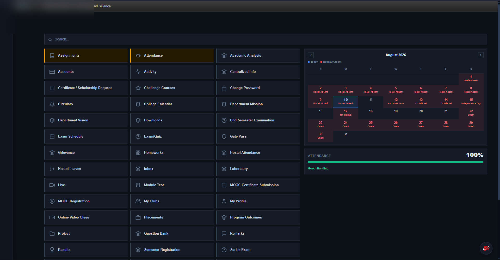
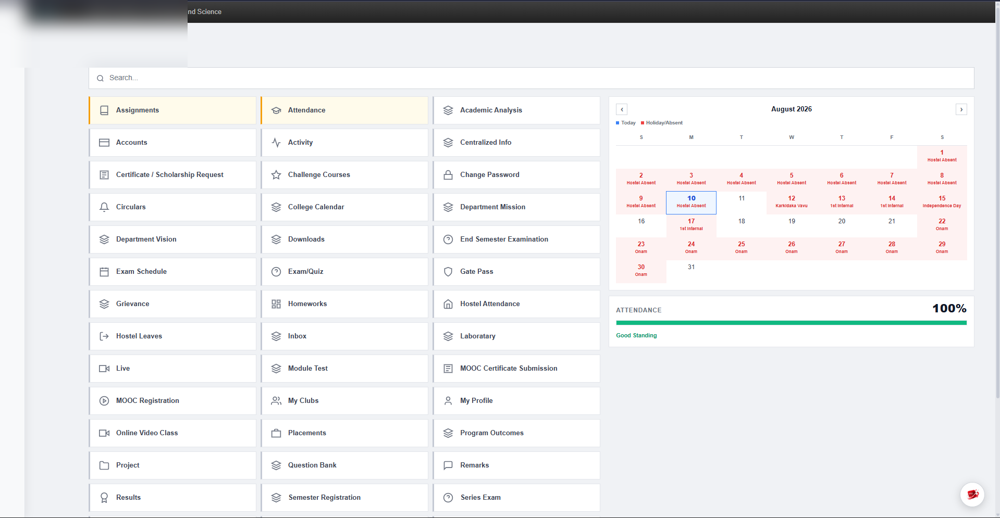
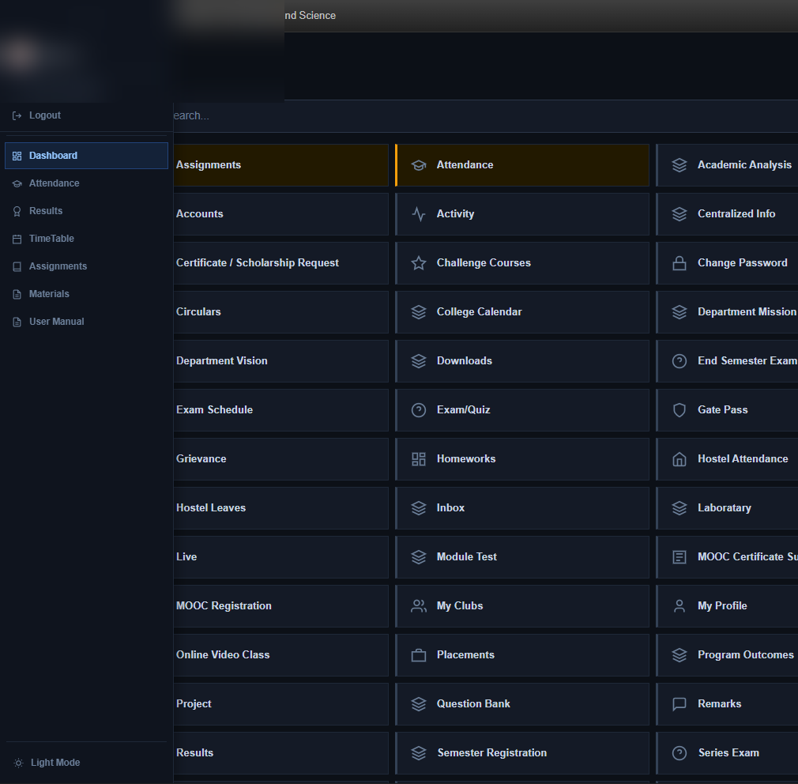

# ETLab MITS Reskin Extension

A premium, modern reskin extension for MITS ETLab (`mits.etlab.app`) that overrides the legacy design with a high-fidelity light/dark responsive dashboard, custom sidebar, unified calendar, and smart search capabilities.

## Features

- **Modern Grey/White Light Theme & Premium Dark Theme**: Toggle between light and dark modes instantly with the floating toggle or sidebar switch.
- **Smart Search Bar**: Quickly filter dashboard action tiles using normal text queries or smart alias keywords (e.g. searching "cgpa" or "grade" shows "Results", "materials" or "notes" shows "Study Materials").
- **Unified Academic & Hostel Calendar**: Synchronized college calendar events, holidays, college absents, and hostel attendance data merged into the dashboard calendar.
- **Dynamic Month Navigation & Background Prefetching**: Instant navigation between months with current month prioritised and surrounding 6 months prefetched seamlessly.
- **Tile Custom Color Customizer**: Star your favorite tiles and highlight specific actions with custom theme colors.
- **Floating Reskin Toggle Button**: A circular toggle button with smooth spin animation to toggle the reskin on/off.

## Installation

1. Clone or download this repository.
2. Open Google Chrome and navigate to `chrome://extensions/`.
3. Enable **Developer mode** (top-right toggle).
4. Click **Load unpacked** (top-left button).
5. Select this `etlab-reskin-ext` folder.
6. Open MITS ETLab (`mits.etlab.app`) and watch the magic happen!

## Previews

### Dark Theme Overview

### Light Theme Overview

### Compact Responsive View

