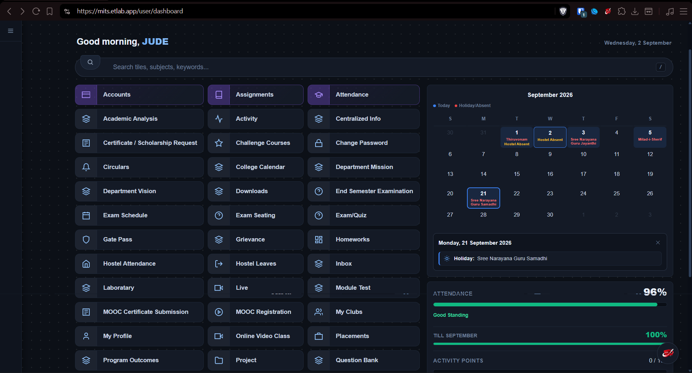
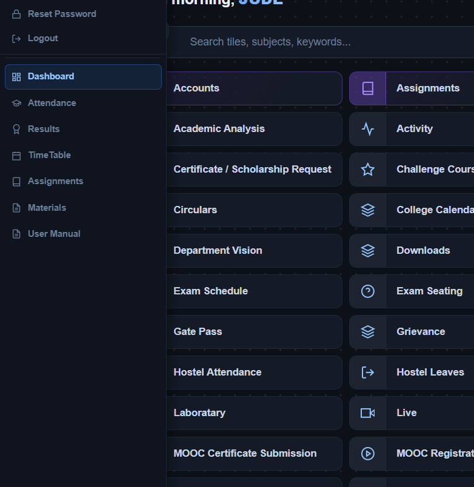
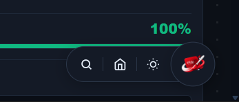

# ETLab MITS — Modern Reskin Extension

A clean, modern interface overhaul for the MITS ETLab portal (`mits.etlab.app`). This extension replaces the legacy UI with a responsive dashboard, unified academic calendar, smart search, and live KTU activity point tracking.

---

## Screenshots

### Dashboard Overview

  

 

### Attendance, Calendar & KTU Activity Points

  

 

### Search Bar & Concept 7 Badges

  

---

## Privacy, Security & How It Works

### 100% Client-Side Execution
- **Zero Data Collection**: This extension does not collect, log, or transmit any user data, credentials, or personal information. There are no remote servers, analytics trackers, or external APIs.
- **Direct Local DOM Modification**: The extension operates entirely within your local browser environment. It injects a local stylesheet (`reskin.css`) and script (`content.js`) to restyle and enhance the existing `mits.etlab.app` webpage.

### Session Security & Credentials
- **Authentication**: All login requests and session tokens are processed directly by the official ETLab servers (`mits.etlab.app`). The extension never intercepts, modifies, or stores passwords.
- **Local Storage**: User preferences (such as light/dark mode, starred favorite tiles, and custom tile colors) are saved strictly on your local machine using the browser's `chrome.storage.local` API.

### Open Source & Auditable
- The entire codebase contains plain JavaScript and CSS with no minified or obfuscated third-party tracking libraries.

---

## Core Features

- **Dual-Tone Split Badge Tiles**: Two-tone tile interface with dedicated icon compartments and customizable high-contrast color accents.
- **Smart Search & Shortcuts**: Real-time filtering with support for common college aliases (e.g., searching "cgpa" finds Results, "notes" finds Study Materials). Press <kbd>/</kbd> or <kbd>Ctrl</kbd>+<kbd>K</kbd> to focus.
- **Unified Academic Calendar**: Integrated display of college events, attendance absents, and hostel leaves with interactive date preview cards.
- **KTU Activity Points Tracker**: Live meter scraping and displaying earned activity points out of 100 with remaining point calculations.
- **Dark & Light Themes**: Calibrated dark theme and light theme with smooth transitions.
- **Extension Popup Control**: Quick-access popup menu with 1-click power switch and theme toggle.

---

## Keyboard Shortcuts

| Shortcut | Function |
| :--- | :--- |
| <kbd>/</kbd> | Focus smart search bar |
| <kbd>Ctrl</kbd> + <kbd>K</kbd> / <kbd>Cmd</kbd> + <kbd>K</kbd> | Focus search bar anywhere on the page |
| <kbd>Esc</kbd> | Dismiss search focus and close open popovers |

---

## Installation

### Desktop (Chrome / Brave / Edge)
1. Clone or download this repository.
2. Open your browser and go to `chrome://extensions/`.
3. Enable **Developer mode** in the top-right corner.
4. Click **Load unpacked** and select the `etlab-reskin-ext` folder.
5. Navigate to [`https://mits.etlab.app/user/dashboard`](https://mits.etlab.app/user/dashboard).

### Android (Kiwi / Lemur Browser)
1. Install **Kiwi Browser** or **Lemur Browser** from Google Play.
2. Download this repository as a `.zip` archive to your device.
3. Open `chrome://extensions` in the browser, enable **Developer mode**, and select **Load from .zip**.
4. Log into `mits.etlab.app`.

---

## License

MIT License. Open source and free to use.
